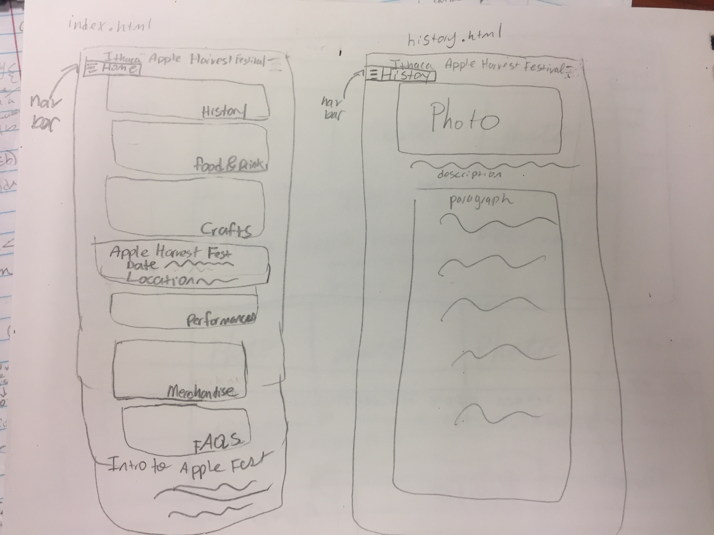
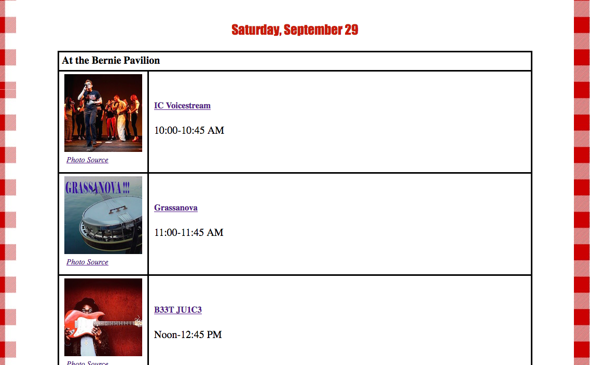

# Project 2 - Design Journey

**For each milestone, complete only the sections that are labeled with that milestone.**

Be clear and concise in your writing. Bullets points are acceptable.

## Milestone 1

### Target Audience (Milestone 1)
[In this part, write down who your target audience is.]

My target audience is Cornell undergraduate students who are living on campus.

### Persona (Milestone 1)
[In this part, create a persona that can represent your target audience, and describe him or her in details below.]

Amy is 19 years old. She is a Cornell sophomore living on West Campus and she is majoring in Computer Science. She's currently stressed out because it is prelim seasons and is busy studying for her prelims. She's not sure if she can attend the Ithaca Apple Harvest Festival cause she has so much work to do. Amy has never been to the festival before. She isn't sure if it is worthwhile to even go, since she wonders how interesting apples can be. Though she thinks she might enjoy the festival because she does enjoy going to the Ithaca Farmer's Market on the weekend.

Amy is an avid shopper and lover of graphic tees. She can be seen wearing her "Ithaca's Gorges" shirt around campus.

### Needs (Milestone 1)
[Collect your target audience's needs and wants for the website and list them one by one. Come up with several appropriate design ideas on how those needs may be met. In the **Memo** field, justify your ideas and add any additional comments you have. There is no specific number of needs required for this, but you need enough to do the job. See the example design journey for an example of how you might do this.]

Format:
- Need/Want #1
  - **Needs and Wants** (What does your client and audience need and want?)
    - Amy needs to know how to get to the festival quickly and as cheaply as possible.
  - **Design Ideas and Choices** (How will you meet those needs and wants?)
    - I can put in what bus routes to take from campus to the Commons.
    - If she wanted she could even walk there, since the walk isn't that long. So, I could even give the average time to walk there from West Campus.
  - **Memo** (Justify your decisions; additional notes.)
    - I want to make a FAQs page that has basic information on the festival such as how to get there. On that page I'll list out what buses to take and how long it takes to walk there. Since the audience is living on campus I will have the bus stops be at RPCC and Baker Tower, since those are the major bus stops of North Campus and West Campus.

- Need/Want #2
  - **Needs and Wants** (What does your client and audience need and want?)
    - She needs to know where nearby ATMs are so she can withdraw cash since not all vendors accept credit card.
  -  **Design Ideas and Choices** (How will you meet those needs and wants?)
    - Create a list of ATMs on campus and ATMs that are near the event.
  - **Memo**
    - This is general information that I can put on the FAQs page since it doesn't make sense to dedicate an entire page to this one topic. I think users would know to go there if they were wondering about this.

    - Need/Want #3
      - **Needs and Wants** (What does your client and audience need and want?)
        - She's interested about the significance of Apple Fest and what it means to the local community.
      -  **Design Ideas and Choices** (How will you meet those needs and wants?)
        - Create a page that discusses a brief history of the Apple Fest.
      - **Memo**
        - I'll embed photos that I had taken and do outside research online about the event. It'll be a few short paragraphs since I know my audience is very busy and doesn't have a lot of time to spend on this.

  -Need/Want #4     
  - **Needs and Wants** (What does your client and audience need and want?)
    - This is her first Apple Fest and she wants a souvenir that will last.
  -  **Design Ideas and Choices** (How will you meet those needs and wants?)
    - On the home page include a photo on how there will be merchandise there is Apple Fest Merchandise. That photo will link to the page that shows the different shirts available and a description of the company that makes them.
  - **Memo**
    - This will fulfill her want of having a souvenir and let her know how much money to bring to the festival to buy the shirts. I plan to make a little gallery of the photos on this page just to show the different designs that are available.

    -Need/Want #5     
    - **Needs and Wants** (What does your client and audience need and want?)
      - She needs to be able to read the website on her phone so she can check the performance schedule while she is there.
    -  **Design Ideas and Choices** (How will you meet those needs and wants?)
      - Increase the font size, so it is easy for her to scan through the website while she is there and check the performance schedule.
    - **Memo**
      -Increasing the font size is important because it will make the website more accessible for her. If she can't use it conveniently on her phone then it might discourage her to attend.

  -Need/Want #6
  - **Needs and Wants** (What does your client and audience need and want?)
    - She needs the website to load quickly while she is out because she doesn't know how well the connection will be at the Commons.
  -  **Design Ideas and Choices** (How will you meet those needs and wants?)
    - What I can do to make the website load as quickly as possible is to change the size of the image before, instead of relying on CSS to do that. This should help in making the website load quicker and make a more enjoyable experience for the user, so she won't have to stand there waiting for it to load.
  - **Memo**
    -This will be an important design because Amy needs to get her information quickly. If the page doesn't load quickly it will create an unenjoyable experience for her and due to how well the connection is the page might not even load even I don't change the photo sizes.

### Sketches / Screenshots / Storyboards (Milestone 1)
[In this part, include the sketches for each of your pages (both desktop and mobile versions). These sketches **must** be done on paper.]

These sketches are for the desktop version.
index.html

history page

food & drinks page

crafts page

performances page

merchandise pages

FAQs pages

These sketches are for the mobile version.

index.html and the history page sketches

food & drinks page and crafts page sketches

performances page and merchandise page sketches

FAQs page sketches

### Additional Design Justifications (Milestone 1)
[If you feel like you haven’t fully explained your design choices, or you want to explain some functions in your site (e.g., if you feel like you make a special design choice which might not meet P2M1 requirement), you can use the additional design justifications to justify your design choices. Remember, this is place for you to justify your design choices which you haven’t covered in Milestone 1. Use it wisely. However, you don’t need to fill out this section if you think all design choices have been well explained in the design journey for Milestone 1.]

I want the index.html to have a collage of photos that when the user clicks the images it takes them to the page that corresponds with the text that is on the image.

On the mobile pages I want to implement using HTML and CSS a drop down menu for my navigation bar, since I've seen on mobile pages this feature.

## Milestone 2

### Task Planning (Milestone 2)
[Plan out your four tasks for Milestone 2 here before doing your user testing]

1. You really like live performances. You've heard people talk about iCircus. You want to know where their performance is located, so you decide to look at the Ithaca Apple Harvest Festival to see if there is any information.

2. You don't want to spend money on an Uber to go to the festival. You decide that since the bus is free on weekends that you will take the bus. You decide to look at the Ithaca Apple Harvest Festival Website to see what bus routes you could possibly take to get to the Ithaca Commons.

3. You're curious what kind of food will be served at Apple Fest. You're looking forward to eating apples, but want to know if there will be normal food vendors there. So, you go on the Ithaca Apple Harvest Festival Website to see if there are two vendors that will have normal food.

4. You like getting souvenirs at festivals. So, you decide to look at the website to see how much money would have to bring to the festival to buy a t-shirt.

### User 1 (Milestone 2)
[In this part, describe your user 1 by answering the questions below.]

1. Who is your user 1, e.g., where user 1 comes from, what is your user 1’s job, characteristics, etc.?
My user is Ashni and she is from California. She is the oldest child and is very responsible. She likes to show up to things on time. Her job is a student and she likes to get off campus when she has time to do so. She does not have a car on campus and she lives on campus too.

2. Does your user 1 belong to your target audience of the site? (Yes / No)
[If “No”, what’s your strategy of associating the user test results to your target audience’s needs and wants? How can your re-design choices based on the user tests make a better fit for the target audience?]

Yes, she belongs to my target audience.

### Tasks for User 1 (Milestone 2)
[Report the results for your user's performance on each of your four tasks. You should **describe the task** you ask the user to complete, explain **what the user did**, describe the user's **reaction/feedback** to the design, **reflect on the user's performance**, determine what **re-design choices** you will make. You can also add any additional comments in the **memo** field. See the example design journey for an example of what this would look like.]

Format:
- Task #1
  - **Task Description** (What was the task for this user?)
    - You really like live performances. You've heard people talk about iCircus. You want to know where their performance is located, so you decide to look at the Ithaca Apple Harvest Festival to see if there is any information.
  - **How did the user do? Did that meet your expectation?**
    - She did meet my expectations because she was able to find where iCircus presented.
    - Though it took a little longer than I expected because she was confused about what iCircus was. She didn't understand that iCircus was a performer. But, once I reread the task to her she realized that iCircus must be a performer.
  - **User’s reaction / feedback to the design** (e.g., specific problems or issues found in the tasks)
    - When asked she said it was well organized and easy to find the performer.
    - Only problem that occurred was just confusion on what iCircus was.
  - **Your reflections about the user’s performance to the task**
    - I don't think the confusion on what iCircus was a problem about the design it was just comprehension because she didn't realize that iCircus was a performer at first.
  - **Re-design choices**
    - I don't think there needs to be any changes in terms of design.
  - **Memo** (Justify your decisions; additional notes.)
    - Since the user was able to find the location of the performance easily I don't think there needs to be a change.
- Task #2
  - **Task Description** (What was the task for this user?)
    - You don't want to spend money on an Uber to go to the festival. You decide that since the bus is free on weekends that you will take the bus. You decide to look at the Ithaca Apple Harvest Festival Website to see what bus routes you could possibly take to get to the Ithaca Commons.
    - I wanted to see if given this information would the user know to go the FAQs page and find the information regarding the bus routes.
  - **How did the user do? Did that meet your expectation?**
    - User met my expectations. She automatically when to the FAQs page and found the necessary information.
    - Skimmed the paragraph to find the necessary information.
  - **User’s reaction / feedback to the design** (e.g., specific problems or issues found in the tasks)
    - She suggested that I should bold the routes so the user can find the information quicker.
  - **Your reflections about the user’s performance to the task**
    - I think she was able to find the information very quickly and that her going to the FAQs page shows that having general information there is logical.
  - **Re-design choices**
    - The idea of bolding the routes I think is a good idea. I think this will help users who are in a rush to find the information quicker. They might already know the information regarding the privileges of when it is free for certain class years to ride the bus and all they want to know if just the bus route they need to take.
  - **Memo** (Justify your decisions; additional notes.)
    - n/a

-Task #3
  - **Task Description** (What was the task for this user?)
    - You're curious what kind of food will be served at Apple Fest. You're looking forward to eating apples, but want to know if there will be normal food vendors there. So, you go on the Ithaca Apple Harvest Festival Website to see if there are two vendors that will have normal food.
  - **How did the user do? Did that meet your expectation?**
    - User met my expectations. She didn't struggle at all and went straight to the "food & drink page."
  - **User’s reaction / feedback to the design** (e.g., specific problems or issues found in the tasks)
    - When asked what she thought about the formatting of the vendors she said she liked it because the list format makes it easy for her to scan quickly.
    - She also mentioned that she liked the collage at the top since it tells her visually what kinds of food she can have to look forward to eating. Also, she liked that is showed the environment of what the festival looked like and what interactions with vendors looked like.
  - **Re-design choices**
    - At this point based off of the feedback I was given I don't need to redesign this part of my website.
  - **Memo** (Justify your decisions; additional notes.)
    -n/a
-Task #4
    - **Task Description** (What was the task for this user?)
      - You like getting souvenirs at festivals. So, you decide to look at the website to see how much money would have to bring to the festival to buy a t-shirt.
      - **How did the user do? Did that meet your expectation?**
        - User met my expectations. She knew to go the merchandise page to find information regarding how much the shirt was.
        - I noticed that she fully moved her head to the right when she looked for the price, which made me think that maybe having the prices on the right isn't the most visible spot.
      - **User’s reaction / feedback to the design** (e.g., specific problems or issues found in the tasks)
        - She said that I should consider moving the prices to either the left hand side or just have it with the rest of the other content.
      - **Re-design choices**
        - What it originally looked like.
        
        - I think I will move it to the left hand side of the row with pictures to make it easier to see. This will be better because we read from left to right. So, it makes sense to have the prices in a spot that will be seen first. This is because my users who read in English read from left to right. In fact, I know that people when they look at a page tend to look at it in a F pattern where they tend to favor the left side of the page over the right side.
        - Thus, when it's on the right it takes the user a little longer to see it and there is a chance that a user wouldn't even notice the prices on the right. I don't want to move it in with the other content because I don't want the prices to get lost in the other content. I want it to appear more distinct by being next to the images of the merchandise.
      - **Memo** (Justify your decisions; additional notes.)
        - n/a

### User 2 (Milestone 2)
[In this part, describe your user 2 by answering the questions below.]

1. Who is your user 2, e.g., where user 2 comes from, what is your user 2’s job, characteristics, etc.?
My user is Juliette. She is from Michigan and is a student at Cornell. She is living on campus this year and does not have a car. She really enjoys riding the TCAT since she thinks ride sharing is really important for the sake of the environment. She is very outgoing and busy. She's involved in a lot on campus and doesn't have a lot of spare time. She's very sentimental and enjoys buying souvenirs so she can remember events.

2. Does your user 2 belong to your target audience of the site? (Yes / No)

[If “No”, what’s your strategy of associating the user test results to your target audience’s needs and wants? How can your re-design choices based on the user tests make a better fit for the target audience?]

Yes, she belongs to my target audience.

### Tasks for User 2 (Milestone 2)
[Report the results for your user's performance on each of your four tasks. You should **describe the task** you ask the user to complete, explain **what the user did**, describe the user's **reaction/feedback** to the design, **reflect on the user's performance**, determine what **re-design choices** you will make. You can also add any additional comments in the **memo** field. See the example design journey for an example of what this would look like.]

The format for this section is the same as the "Tasks for User 1" section above.

- Task #1
  - **Task Description** (What was the task for this user?)
    - You really like live performances. You've heard people talk about iCircus. You want to know where their performance is located, so you decide to look at the Ithaca Apple Harvest Festival to see if there is any information.
  - **How did the user do? Did that meet your expectation?**
    - My expectations were met because she was able to find where iCircus presented.
    - She scrolled down the page to first find iCircus and then she went up to see where the location was.
  - **User’s reaction / feedback to the design** (e.g., specific problems or issues found in the tasks)
    - She said the way the content was organized by location and time made logical sense. She suggested that the name of the performer be increased since it is currently a little smaller than the time.
  - **Your reflections about the user’s performance to the task**
    - She was able to find the information very quickly. So, I do think the content is well organized.
  - **Re-design choices**
    - What it originally looked like.
    
    - A design change that can be done is to increase the size of the performers name so then the given information in the box appears more hierarchical. With the performers name being the most important and then the time.
  - **Memo** (Justify your decisions; additional notes.)

- Task #2
  - **Task Description** (What was the task for this user?)
    - You don't want to spend money on an Uber to go to the festival. You decide that since the bus is free on weekends you will take the bus. You decide to look at the Ithaca Apple Harvest Festival Website to see what bus routes you could possibly take to get to the Ithaca Commons.
  - **How did the user do? Did that meet your expectation?**
      - User met my expectations. She quickly went to the FAQs page and found the necessary information.
      - It took her less than 30 seconds.
  - **User’s reaction / feedback to the design** (e.g., specific problems or issues found in the tasks)
    - She suggested that on FAQs she had seen in the past at the top they put a list of the questions at the top that the user can look at and then click.
  - **Your reflections about the user’s performance to the task**
    - Less than 30 seconds isn't a long time to find a bus route since the user first has to locate the specific question and scan through the paragraph to find the bus route.
  - **Re-design choices**
    - I think I will put at the top the questions, so that the user can first look there to find their specific question and then click it to take him to the answer. This will be better because then the user doesn't have to waste time scrolling past questions and answers that don't pertain to him.
  - **Memo** (Justify your decisions; additional notes.)
    - This would make the design a little more organized, easier to use, and save the user time.

-Task #3
  - **Task Description** (What was the task for this user?)
    - You're curious what kind of food will be served at Apple Fest. You're looking forward to eating apples, but want to know if there will be normal food vendors there. So, you go on the Ithaca Apple Harvest Festival Website to see if there are two vendors that will have normal food.
  - **How did the user do? Did that meet your expectation?**
    - User scrolled straight down to look at the list of vendors.
    - This met my expectations and she didn't take a long time doing the task.
  - **User’s reaction / feedback to the design** (e.g., specific problems or issues found in the tasks)
    - She said it was very easy to understand this design.
    - She recommended that I add links to the vendor's websites since she's vegan and wants to know beforehand if she will be able to eat anything else besides apples.
  - **Re-design choices**
    - I will add in links to the websites or Facebook pages of these vendors. So, it will meet the needs of people with different dietary concerns.
  - **Memo** (Justify your decisions; additional notes.)
    -n/a

  -Task #4
  - **Task Description** (What was the task for this user?)
    - You like getting souvenirs at festivals. So, you decide to look at the website to see how much money would have to bring to the festival to buy a t-shirt.
  - **How did the user do? Did that meet your expectation?**
    - User was able to easily find how much it costs to buy a t-shirt there.
    - It took her less than 15 seconds, which met my expectations.
  - **User’s reaction / feedback to the design** (e.g., specific problems or issues found in the tasks)
    - She said that the layout of this page made sense. She said she liked how the information of who made the shirts was at the top because when she has looked at clothes online before they have information about the clothing at the top of the page.
  - **Re-design choices**
    - Based off of the feedback she gave I wouldn't make any additional changes beyond the one I decided to make with the first user.
    - **Memo** (Justify your decisions; additional notes.)
      -n/a    

### Additional Design Justifications (Milestone 2)
[If you feel like you haven’t fully explained your design choices in the design journey for Milestone 2, or you want to explain some functions in your site (e.g., if you feel like you make a special design choice which might not meet P2M2 requirement), you can use the additional design justifications to justify your design choices. Remember, this is place for you to justify your design choices which you haven’t covered in Milestone 2. Use it wisely. However, you don’t need to fill out this section if you think all design choices have been well explained in the design journey for Milestone 2.]

I realized that the type of navigation feature I had in my responsive design is not feasible for me to do yet, since it requires JavaScript. I've decided to create a more simple navigation bar in my responsive design that lists in order the different pages on my website.

### What each page of the draft version looked like.
index.html

history.html

food&drink.html

crafts.html

performances.html

merchandise.html

faqs.html

---

## Final Submission

### Task Planning (Final Submission)
[Plan out your four tasks for the Final Submission here before doing your user testing. These should probably be the same as your tasks from Milestone 2, unless you are changing them to address problems with your tasks that you discovered in the first user test.]

1. You've never been to Apple Fest before. So, you decide to go to the Ithaca Apple Harvest Festival website to learn what the backstory of the festival.

2. You like live performances. You decide to see if there are any interesting performers and see if you can learn any information about them.

3. You're low on cash. In the past when you have been to festivals they have only accepted cash. You're curious if they will accept credit card and if not if there are any nearby ATMs for you to withdraw cash.

4. You've seen multiple people walk past you with mac & cheese. You wonder if the website might have any information where they most likely got the mac & cheese from.

### User 3 (Final Submission)
[In this part, describe your user 3 by answering the questions below.]

1. Who is your user 3, e.g., where user 3 comes from, what is your user 3’s job, characteristics, etc.?
Liel is from New Jersey. She's a sophomore at Cornell and her job is a student. She is very outspoken and involved in political organizations at Cornell. She enjoys getting off campus on weekends by going hiking and visiting the local farmer's market. She is a voracious reader and enjoys writing.

2. Does your user 3 belong to your target audience of the site? (Yes / No)

[If “No”, what’s your strategy of associating the user test results to your target audience’s needs and wants? How can your re-design choices based on the user tests make a better fit for the target audience?]

Yes

### Tasks for User 3 (Final Submission)
[Report the results for your user's performance on each of your tasks. You should **describe the task** you ask the user to complete, explain **what the user did**, describe the user's **reaction/feedback** to the design, **reflect on the user's performance**, determine what **re-design choices** you will make. You can also add any additional comments in the **memo** field. See the example design journey for an example of what this would look like.]

Format:
- Task #1
  - **Task Description** (What was the task for this user?)
    -You've never been to Apple Fest before. So, you decide to go to the Ithaca Apple Harvest Festival website to learn what the backstory of the festival.
  - **How did the user do? Did that meet your expectation?**
    - The user was able to quickly go to the history page and read the paragraphs about apple fest.
    - This met my expectations because I assumed that the user would know to go to the history page.
  - **User’s reaction / feedback to the design** (e.g., specific problems or issues found in the tasks)
    - She told me that I should think about rewriting the last sentence of my article on the history page. She says that the wording is confusing and that the sentence is too long.
    - She says she liked learning about the history of the festival and that the article wasn't long. She said that if it was longer she probably would not have read it.
  - **Your reflections about the user’s performance to the task**
    - The user was able to navigate well to the site.
    - I'm glad that she actually read it. Since I did purposefully make the article not too long because I know that users aren't going to want to read a long article. So, it was nice to learn that it was just the right length.
  - **Re-design choices**
    - I'm going to rewrite that last sentence by cutting it up into smaller sentences.
    - I hadn't really realized that the sentence was a run on sentence until she mentioned it. I'm really glad that I was able to have another person read my writing because since I was the one who wrote it the sentence made sense to me.
  - **Memo** (Justify your decisions; additional notes.)
    - [You should fill this out]
- Task #2
  - **Task Description** (What was the task for this user?)
    - You like live performances. You decide to see if there are any interesting performers and see if you can learn any information about them.
  - **How did the user do? Did that meet your expectation?**
    - The user went to the performances tab. Then she scrolled through the schedule.
    - She then went to the link for Rachel Beverly and started watching the videos she posted.
    - The user also listened to some of B33T JU1C3's music.
    - This actually exceeded my expectations since I didn't really expect the user to interact that much with it.
    - I thought the user would just look for a performer and click the link and immediately go back to the Ithaca Apple Harvest Festival.
    - But, the user actually got into the performers and spent a while looking at their websites.
    - The user said "I wish she (Rachel Beverly) was performing when I went to Apple Fest. I'd go to see her."
  - **User’s reaction / feedback to the design** (e.g., specific problems or issues found in the tasks)
    - User liked the schedule because it wasn't just times listed with a performer's name.
    - She liked that she was able to interact with the schedule to look further into who a performer was because of the link I put into the perform's website.
    - She said that she would use this schedule if she wanted to know who was playing or if she heard someone playing at the festival and would to look up who the performer is after the festival.
    - No feedback to the design except that she liked it.
  - **Your reflections about the user’s performance to the task**
    - It make sense though that a user would take the time to click through the performer's different links. Since users can use the quality of the performer to decide on what time to go to the festival to see that performer.
    - The links to the performer's website allows the user to become more excited about the festival and know what they can experience there.
  - **Re-design choices**
    - So far I have no re-design choices.
  - **Memo** (Justify your decisions; additional notes.)
    - [You should fill this out]
- Task #3
  - **Task Description** (What was the task for this user?)
    - You're low on cash. In the past when you have been to festivals they have only accepted cash. You're curious if they will accept credit card and if not if there are any nearby ATMs for you to withdraw cash.
  - **How did the user do? Did that meet your expectation?**
    - The user did go to the FAQs page and used the links to the questions on the top to find the answer to the question.
    - This did meet my expectations because she was able to meet it quickly.
  - **User’s reaction / feedback to the design** (e.g., specific problems or issues found in the tasks)
    - Though she was able to find the question quickly there was actually a problem with the links I put at the top.
    - You see the question on the top that was linked to cost was "What is the cost to attend the festival."
    - She said with the wording of that question she wasn't sure if she would even find the relevant information. She says she made a guess that because that question had to do with cost it might have the answer for the task.
    - She said I should reword the question. This is because the way that it was it seems like there are only questions about a possible entrance fee rather than payment options.
  - **Your reflections about the user’s performance to the task**
    - The user did well because she made an educated guess. But, she brought up a good point. What if a user didn't make that educated guess. The user would be frustrated and assume that the information must not be there.
    - The user found a mistake I did not realize. I thought the way the links were originally was fine. I can see how it would be very confusing with only "What is the cost to attend the festival" being linked at the top. The reason is that users who do have an interest about payment options will assume that because no question at the top seems to be about payment options there must be no information about it.
  - **Re-design choices**
    - Users should not have to make an guess that clicking a certain link will give them the information they are looking for. The layout and content should be clear for the user, so the user is confident he/she will find the relevant information.
    - I realized that the problem was that I actually forgot to provide a link for the question "Do the vendors and farmers accept credit?". I need to add this link up at the top, in order for my users to have a better experience on my site.
    - **Memo** (Justify your decisions; additional notes.)
      - [You should fill this out]
- Task #4
  - **Task Description** (What was the task for this user?)
    -You've seen multiple people walk past you with mac & cheese. You wonder if the website might have any information where they most likely got the mac & cheese from.
  - **How did the user do? Did that meet your expectation?**
    - User went to the food & drinks page and looked at the list of vendors.
    - She was able to guess based off the vendors that it was probably Macarollin' who was selling the Mac & Cheese.
  - **User’s reaction / feedback to the design** (e.g., specific problems or issues found in the tasks)
    - User said that although the content looks clean and neat it isn't too engaging to look at.
    - She likes the photos of food at the top, but her problem was with the list of vendors.
    - She said "it looks bland" and that it looked just "tacked on to the website."
    - She recommended that I make the list of vendors similar to what I did for the performance schedule.
  - **Your reflections about the user’s performance to the task**
    - User was able to find the information quickly because the page was set up neatly.
    - The list format does allow the user to be able to find information quickly.
  - **Re-design choices**
      - Although the user found the information quickly she didn't really enjoy her experience.
      - She didn't like how it was just a list.
      - Therefore, I think I will make it similar to the layout on the performance schedule.
      - I think that it will help users be more interested in the page. Plus, if I had the logo or a photo of their food if they don't have a logo it might make it easier for users to find the vendor when they are at the festival. The reason is that they can look for the logo or an area where they have that specific type of food while they are at the festival.
      - If the vendor does not have a logo, I can use a photo of their food. This would improve user experience because then they can see what kind of food they can enjoy eating.
  - **Memo** (Justify your decisions; additional notes.)
    - [You should fill this out]

### User 4 (Final Submission)
[In this part, describe your user 4 by answering the questions below.]
1. Who is your user 4, e.g., where user 4 comes from, what is your user 4’s job, characteristics, etc.?
My user is Jack and he is a freshman. Since he is a freshman he is living on North Campus. His job is being a student. As a freshman he doesn't really know what the big things on campus and in the local community are. He's enthusiastic, really enjoys making memes, and likes to hang out with friends on weekends.

2. Does your user 4 belong to your target audience of the site? (Yes / No)

[If “No”, what’s your strategy of associating the user test results to your target audience’s needs and wants? How can your re-design choices based on the user tests make a better fit for the target audience?]

Yes

### Tasks for User 4 (Final Submission)
[Report the results for your user's performance on each of your tasks. You should **describe the task** you ask the user to complete, explain **what the user did**, describe the user's **reaction/feedback** to the design, **reflect on the user's performance**, determine what **re-design choices** you will make. You can also add any additional comments in the **memo** field. See the example design journey for an example of what this would look like.]

- Task #1
  - **Task Description** (What was the task for this user?)
    - You've never been to Apple Fest before. So, you decide to go to the Ithaca Apple Harvest Festival website to learn what the backstory of the festival.
  - **How did the user do? Did that meet your expectation?**
    - User had some trouble getting to the history page since the image that links to the history page was not working.
    - The user was able to get to the page using the navigation bar.
    - This didn't meet my expectations because I thought the link on the image worked.
    - I had anticipated this going more smoothly.
  - **User’s reaction / feedback to the design** (e.g., specific problems or issues found in the tasks)
    - User felt frustrated and confused that the clickable image was not working for him.
    - User also recommended that I move the location of the dates and times on the index.html to the top of the page in the header. He said that the current location of it is hidden and that people could miss it.
  - **Your reflections about the user’s performance to the task**
    - The user did not do as well as I had anticipated due to the linking issue.
  - **Re-design choices**
    - I realized that the link I used for the history image did not lead to history.html. Rather, I accidentally had it linked to the index.html. So, I'm going to fix that issue.
    - I'm going to put the dates and times at the top in the header, so that the users always know what days and times the festival is at. I think this is important so that the user doesn't forget when the festival is.
  - **Memo** (Justify your decisions; additional notes.)
    - [You should fill this out]
- Task #2
  - **Task Description** (What was the task for this user?)
    -You like live performances. You decide to see if there are any interesting performers and see if you can learn any information about them.
  - **How did the user do? Did that meet your expectation?**
    - User was able to get to the performance page with ease and clicked on a few of the links for the performers.
    - This met my expectations since it was to see if the schedule was organized out properly and if the performers stood out to make a user want to click on the links to the performer's personal page.
  - **User’s reaction / feedback to the design** (e.g., specific problems or issues found in the tasks)
    - User recommended that the link to the performer's website open in another page.
    - He said that the other website opening in the same window as like "shipping me off to somewhere else."
  - **Your reflections about the user’s performance to the task**
    - The user was able to perform the task well. I think this is because the way the schedule is organized makes logical sense. Also, the user knows that the name of the performers are clickable links because I kept the links underlined.
  - **Re-design choices**
    - I am not going to redesign anything.
  - **Memo** (Justify your decisions; additional notes.)
    - I did consider the user's feedback of having the links open in another window. However, when I looked up in the textbook how to do it it said that it was not really best practice to do that.
    - https://medium.com/the-metric/links-should-open-in-the-same-window-447da3ae59ba
    - I also read the article whose link I placed above when considering this decision. I learned that wanting your user to just stay on your site is not a valid reason to have a link open in another window. Also, that I shouldn't be forcing my design preference on the user since not everyone links having a link open in another window. In fact, it can sometimes cause discomfort for users and create a negative experience.
    - Another reason why I have decided not to have the link open in a new window is that it is an accessibility issue. Links creating new windows can actually cause problems with screen readers and confuse the system.
- Task #3
  - **Task Description** (What was the task for this user?)
    - You're low on cash. In the past when you have been to festivals they have only accepted cash. You're curious if they will accept credit card and if not if there are any nearby ATMs for you to withdraw cash.
  - **How did the user do? Did that meet your expectation?**
    - The user met my expectations because he went to the FAQs page and found the specific information.
  - **User’s reaction / feedback to the design** (e.g., specific problems or issues found in the tasks)
    - User said that it was common sense to bring cash to the festival. And that it wasn't necessary information.
  - **Your reflections about the user’s performance to the task**
    - I'm glad that the user was able to perform the task efficiently and quickly with zero frustration or confusion.
  - **Re-design choices**
    - I am going to keep this question on the FAQs.
    - **Memo** (Justify your decisions; additional notes.)
      - Considering that there are numerous forms of payment now from cash, credit, to Venmo I think users would still want to have this information accessible to them. Since it can be sort of confusing when some vendors accept credit or Venmo, while only some accept credit.
      - Therefore, I think it is nice to just keep it on the FAQs page as a reminder that it is probably best to bring cash and that there are nearby ATMs on campus.
- Task #4
  - **Task Description** (What was the task for this user?)
    - You've seen multiple people walk past you with mac & cheese. You wonder if the website might have any information where they most likely got the mac & cheese from.
  - **How did the user do? Did that meet your expectation?**
    - User had difficulty making an assumption on who the vendor was.
    - The user knew how to get to the food & drinks page, but had problems finding the vendor when he quickly scanned the page.
  - **User’s reaction / feedback to the design** (e.g., specific problems or issues found in the tasks)
    - The user didn't realize that there would be food other than apple related items because the first line of the page said "apples, apples, and MORE APPLES." The user said that it made him think immediately that only apples would be there.
  - **Your reflections about the user’s performance to the task**
    - I can see how if a user is in a rush the user isn't going to read everything on the page. Rather, the user is going to scan the page quickly. Therefore, that first line on a page is critical to act as a brief summary of the user. The reason is that I learned from this user that my first sentence is misleading for the user.
  - **Re-design choices**
      - I am going to clarify that first sentence more by adding in "AND MORE GOODIES!" Also, I'm going to change the list of vendors into a format similar to what I did with the performers with the picture next to the name of the vendor.
  - **Memo** (Justify your decisions; additional notes.)
    - [You should fill this out]

### Additional Users...
[If you conduct more user tests of your website, copy the sections "User 4" and "Tasks for User 4" to make sections for User 5, User 6, etc. You are not *required* to conduct these additional tests, but you might find them helpful for refining your website.]

### Additional Design Justifications (Milestone Final Submission)
[If you feel like you haven’t fully explained your design choices in the final submission, or you want to explain some functions in your site (e.g., if you feel like you make a special design choice which might not meet P2 Final requirement), you can use the additional design justifications to justify your design choices. Remember, this is place for you to justify your design choices which you haven’t covered in the design journey. Use it wisely. However, you don’t need to fill out this section if you think all design choices have been well explained in the final submission design journey.]

I've changed the look of my collage on the index.html. Originally, it looked like this.

I decided to put the photo that says "Ithaca Apple Harvest Festival" and has the dates to be at the top. The reason is that I felt like the way it was originally did not flow correctly and it didn't look like a traditional website. Since on websites usually the main image is at the top and acts as a banner for the home page. Also, I considered the design principle of proximity when it came to the smaller images in collage. The reason is that the way I had it it was that I broke up items that are related to each other. They're related to each other because they are all images that lead to other pages on the website. By having them close together it tells the users that these buttons have some type of relation to each other, which in this case is function.
